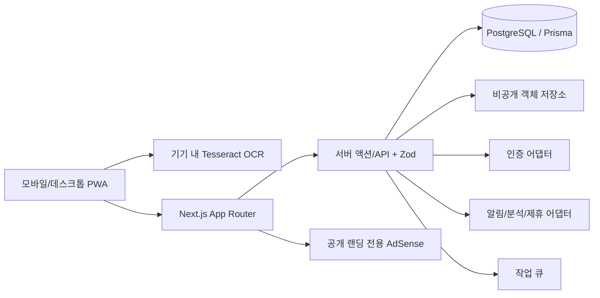

# 아키텍처

## 구성

## 경계와 불변조건

- 브라우저는 DB, AI 키, 저장소 키에 직접 접근하지 않는다.
- 모든 케이스 자원 요청은 서버에서 `case_members`의 활성 역할을 확인한다. UI 숨김은 보안 경계가 아니다.
- DB 접근 정책(RLS 사용 시)과 서버 검사를 함께 적용하고 `case_id` 누락을 테스트한다.
- 사진 OCR은 자체 호스팅한 실행 파일과 한국어 데이터를 사용해 브라우저에서 수행한다. 원본 사진은 서버로 전송하지 않는다.
- 확인한 OCR 텍스트만 검증된 JSON으로 저장한다. 서버 AI 분석과 결제는 기능 플래그로 차단한다.
- 광고 스크립트는 승인된 환경변수가 있을 때 공개 랜딩에서만 렌더링한다.
- 정책/동의는 변경 가능한 문서 ID가 아니라 불변 버전 ID와 제시 원문 해시를 증적으로 남긴다.
- 시간은 UTC, 표시는 Asia/Seoul; 금액은 원 단위 정수다.

## 어댑터

`AuthProvider`, `ObjectStorageProvider`, `NotificationProvider`, `AnalyticsProvider`, `PartnerLeadProvider`를 서버 인터페이스로 분리한다. 이전 AI·결제 어댑터는 다음 단계 호환용으로만 남고 기본값에서는 호출되지 않는다. 운영 구현은 환경변수 검증이 실패하면 시작 또는 해당 기능을 안전하게 차단한다.

## 비동기 흐름

OCR은 브라우저에서 진행률을 표시하고, 사용자가 확인한 텍스트는 즉시 `CONFIRMED`로 저장한다. 삭제는 `REQUESTED → QUARANTINED → PURGED`; 알림은 동의·환경·중복 여부를 재검사한 후 발송한다. 민감 원문을 오류 로그에 남기지 않는다.

## 관찰성과 복구

구조화 로그에는 요청/지원 코드, 가명 사용자 ID, 작업 ID, 결과 코드만 기록한다. 감사로그는 행위자·대상·전후 요약·시각을 append-only로 보존한다. DB 일일 백업, 객체 저장소 수명주기, 복구훈련과 RPO/RTO는 출시 전에 운영자가 확정한다.
